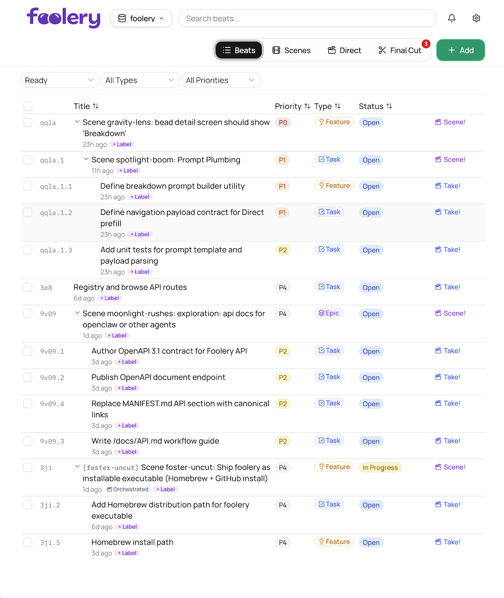
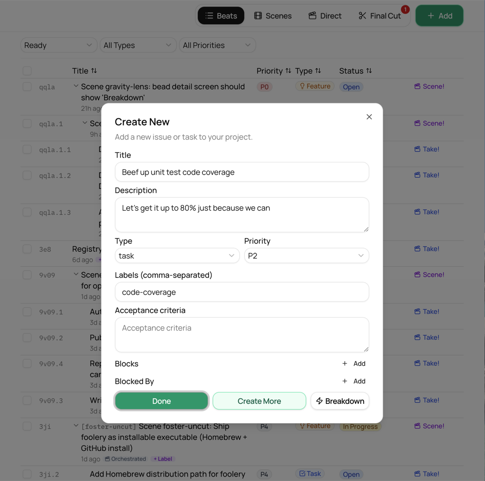
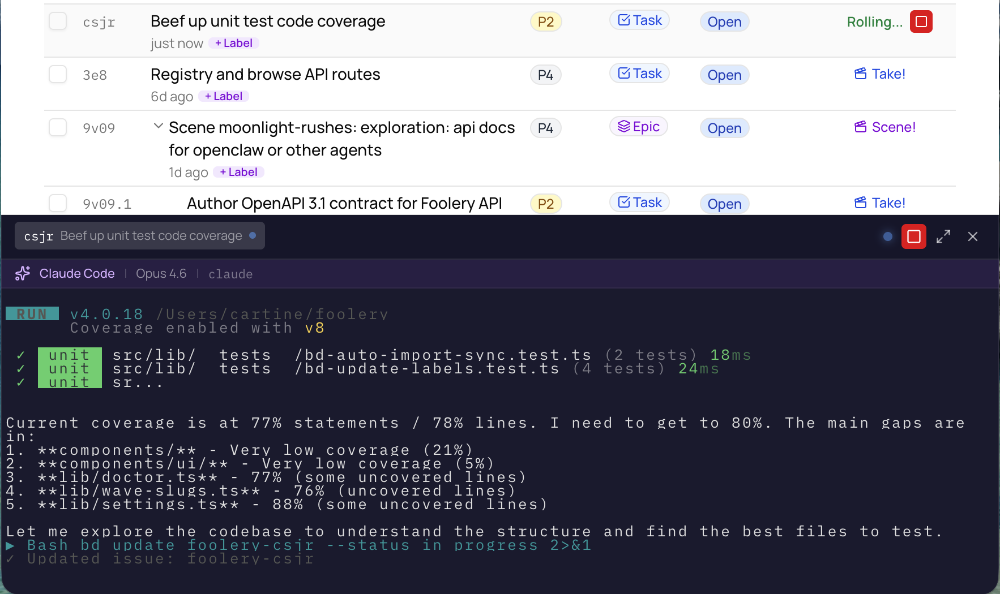
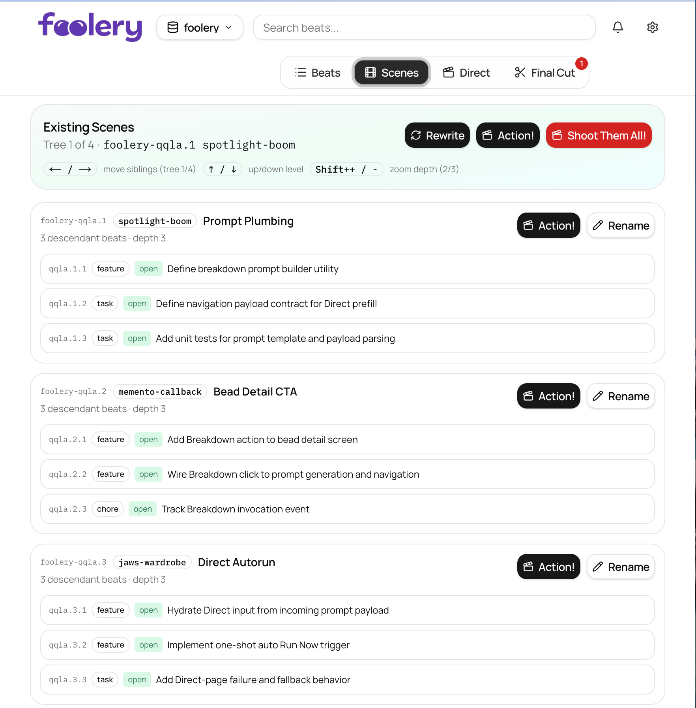
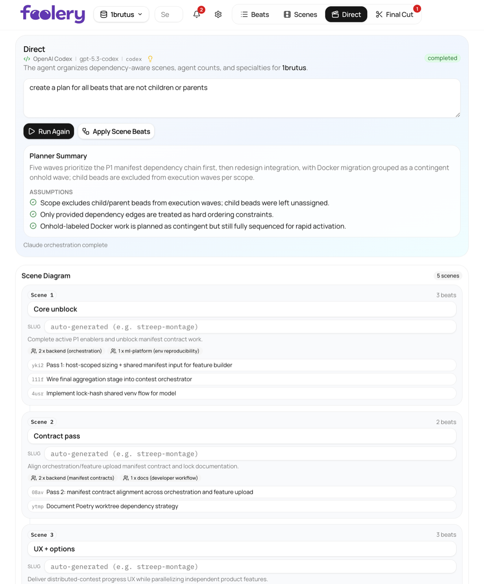
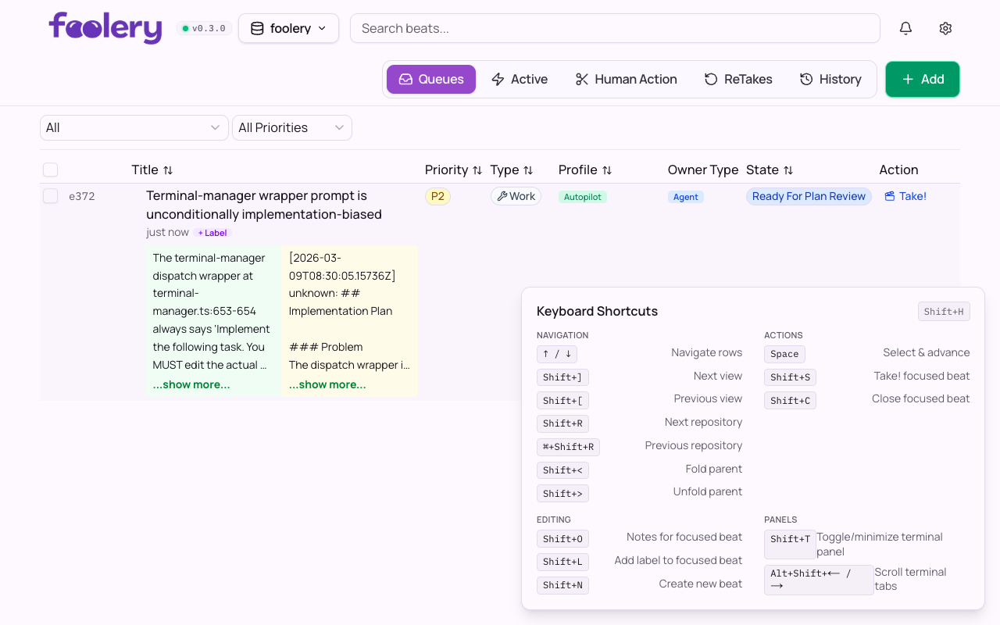
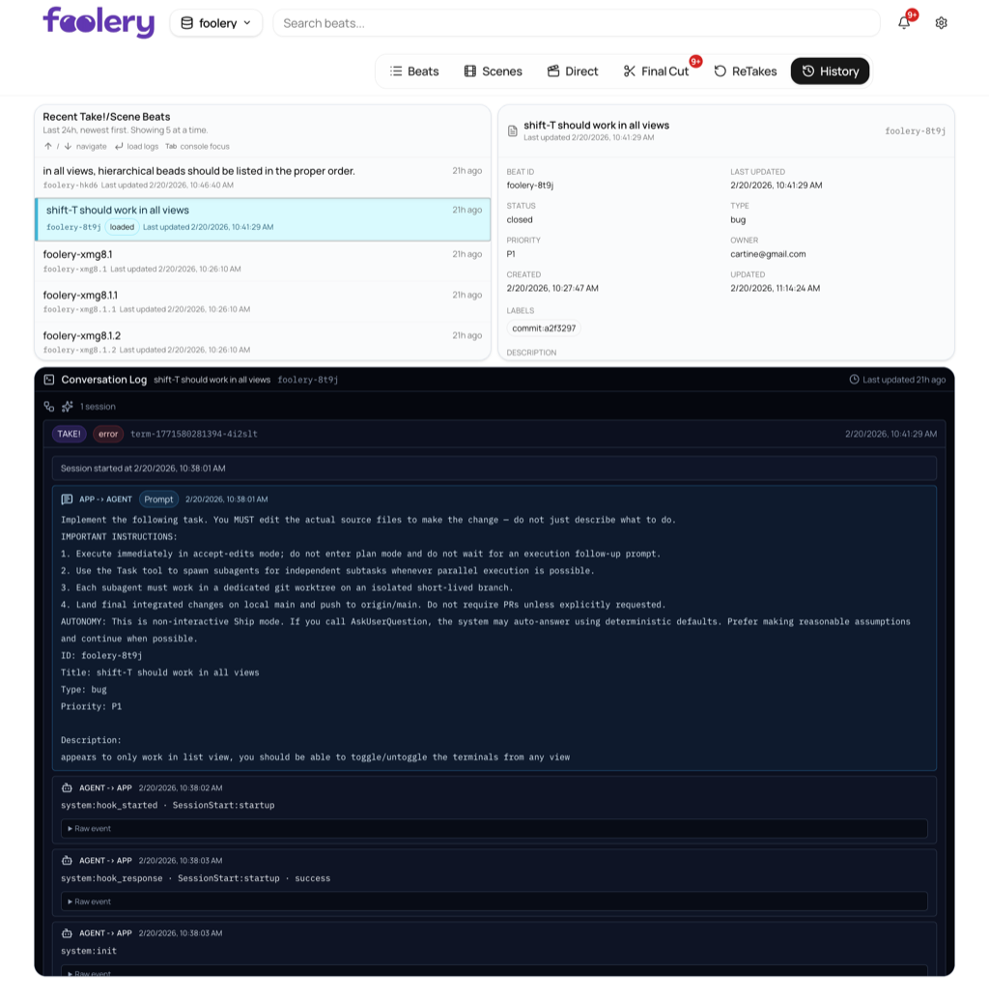
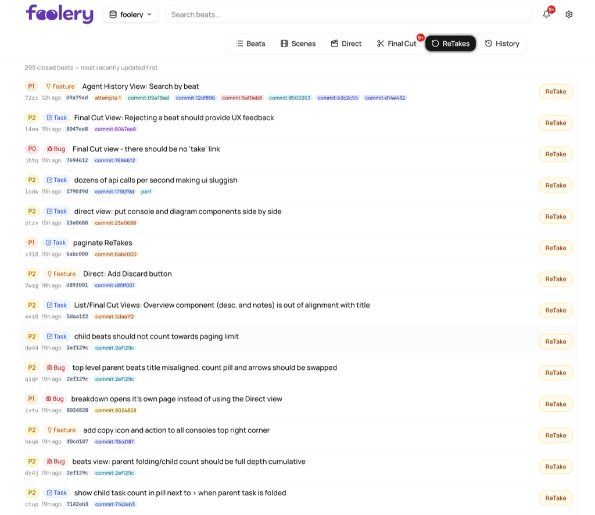

# Foolery

**Product-focused agentic orchestration tool** — one layer up from managing 8 agent terminals, one level down from massively multi-agent chaos.


[](https://github.com/acartine/foolery/releases)
[](https://github.com/acartine/foolery/blob/main/LICENSE)

<table align="center">
  <tr>
    <td align="center">
      <a href="docs/screenshots/beats.png">
        
      </a>
      <br />
      <sub><b>Beats</b></sub>
    </td>
    <td align="center">
      <a href="docs/screenshots/new-beat.png">
        
      </a>
      <br />
      <sub><b>New Beat</b></sub>
    </td>
    <td align="center">
      <a href="docs/screenshots/take.png">
        
      </a>
      <br />
      <sub><b>Take!</b></sub>
    </td>
    <td align="center">
      <a href="docs/screenshots/scenes.png">
        
      </a>
      <br />
      <sub><b>Scenes</b></sub>
    </td>
    <td align="center">
      <a href="docs/screenshots/direct.png">
        
      </a>
      <br />
      <sub><b>Direct</b></sub>
    </td>
  </tr>
  <tr>
    <td align="center">
      <a href="docs/screenshots/final-cut.png">
        
      </a>
      <br />
      <sub><b>Final Cut</b></sub>
    </td>
    <td align="center">
      <a href="docs/screenshots/hot-keys.png">
        
      </a>
      <br />
      <sub><b>Hot Keys</b></sub>
    </td>
    <td align="center">
      <a href="docs/screenshots/agent-history.png">
        
      </a>
      <br />
      <sub><b>Agent History</b></sub>
    </td>
    <td align="center">
      <a href="docs/screenshots/retake.png">
        
      </a>
      <br />
      <sub><b>ReTake</b></sub>
    </td>
    <td></td>
  </tr>
</table>

Foolery is a local web UI that sits on top of [Beads](https://github.com/steveyegge/beads) issue tracking, giving you a visual control surface for organizing, orchestrating, and reviewing AI agent work across your repositories.

[Check out the substack on why I built this.](https://open.substack.com/pub/thecartine/p/foolery-the-app?r=1rb8nt&utm_campaign=post&utm_medium=web&showWelcomeOnShare=true) It won't make you dumber.

## Install

**Prerequisites:** [Node.js](http://nodejs.org), [curl](http://curl.se), [tar](http://www.gnu.org/software/tar/), and [Beads](https://github.com/steveyegge/beads) (`bd` CLI).

```bash
curl -fsSL https://raw.githubusercontent.com/acartine/foolery/main/scripts/install.sh | bash
```

If `~/.local/bin` is not on your `PATH`:

```bash
export PATH="$HOME/.local/bin:$PATH"
```

Then run the following commands:

```bash
foolery setup
foolery start
```

## Flow & Features

### Beats

The main table. See every beat at a glance — filter by status, type, priority, or free-text search. Select rows with spacebar, bulk-update fields, drill into inline summaries, and trigger agent sessions on any beat.


### Enter a Beat
Rapid, basic task creation - Shift-N, tab, tab, enter, done.


### Scenes

Browse and manage your orchestration trees. Navigate dependency hierarchies with keyboard arrows, zoom in/out on wave depth, rename slugs, and trigger execution on any wave with a single shortcut.


### Take! Terminal

One-click or bulk select - Launch an agent run from the table and monitor it live in the built-in terminal drawer without leaving the app context.


### Direct

The planning room. Select a set of beats and ask Claude to organize them into dependency-aware scenes. Watch the plan stream in real time, edit wave names and agent counts, then apply the whole orchestration with one click.


### Final Cut

The verification queue. Every beat labeled `stage:verification` lands here. Review each one, approve it, or reject it with notes — keeping your done list honest.


### Agent History

A focused history feed for agent implementation sessions. Browse recent beat activity, inspect beat metadata, and review app-to-agent and agent-to-app messages in one timeline.


### ReTake

The redo lane for follow-up agent passes. Re-run work with tighter prompts, keep retries visible, and iterate without losing the original beat context.


### Hot Keys

Need to stay in flow? Open the keyboard shortcut overlay for a quick map of navigation, actions, editing, and panel controls across views.


## Why Foolery?

- **Rapid scratch pad for small bugs and big ideas alike.** Create a beat, fire off an agent, review the result — all without leaving the keyboard.
- **Leverage agents to organize groups of work and optimize them for parallel execution.** Ask Claude to decompose a set of tasks into dependency-aware waves, then launch them scene by scene.
- **Track "completed" work units in a first-class way — accept or reject them with notes.** Every finished beat flows into a verification queue where you approve, reject, or annotate before it's truly done.
- **Keyboard-first workflow.** Navigate, select, bulk-update, and trigger agent sessions entirely from the keyboard.
- **Dependency-aware wave planning.** Visualize what's runnable, what's blocked, and what's next — across your whole project.
- **Multi-repo support.** Switch between repositories or view beats across all of them in one place.

## How to Contribute

See the **[Developer Guide](docs/DEVELOPING.md)** for architecture, conventions, testing, and contribution guidelines.
For clones that use Dolt-native Beads sync hooks, run `bash scripts/setup-beads-dolt-hooks.sh` once and see **[docs/BEADS_DOLT_HOOKS.md](docs/BEADS_DOLT_HOOKS.md)**.

## Foolery Prompt Guidance (Highly Recommended)

Foolery works best when every repo has explicit agent handoff rules in `AGENTS.md` and/or `CLAUDE.md`.
Use:

```bash
foolery prompt
```

This appends Foolery's guidance prompt (`PROMPT.md`) into whichever default prompt files already exist in the current repository.

Why this matters:
- Agents must move a bead to `in_progress` before any edits or commits.
- Handoff must include `commit:<short-sha>` label first, then `stage:verification`.
- Beads stay open for verification; do not close unless explicitly instructed.
- Work is not complete until changes are pushed to `origin/main`.

During `foolery setup`, Foolery will ask if you want to apply this guidance to mounted repos and marks it as highly recommended.
`foolery doctor` also warns when prompt files are present but missing Foolery guidance.

## Key Shortcuts
Shift+H to view at any time!

| Shortcut | Action |
|----------|--------|
| `↑ / ↓` | Navigate rows |
| `Space` | Select row & advance |
| `Shift+]` / `Shift+[` | Next / previous view |
| `Shift+R` / `⌘+Shift+R` | Next / previous repository |
| `Shift+S` | Take! (start agent session) |
| `Shift+V` | Verify (close) focused beat |
| `Shift+C` | Close focused beat |
| `Shift+F` | Reject focused beat |
| `Shift+O` | Open notes dialog |
| `Shift+L` | Add label to focused beat |
| `Shift+N` | Create new beat |
| `Shift+T` | Toggle terminal panel |
| `Shift+H` | Toggle shortcut help |

## Commands
```bash
foolery
foolery open
foolery update
foolery stop
foolery restart
foolery status
foolery uninstall
```

`foolery` is the default open flow: if the server is down it starts it, then opens the app URL only if it is not already open.
`foolery start` launches the backend in the background, prints log paths, opens your browser automatically, and returns immediately.
`foolery open` opens Foolery in your browser without spawning duplicate tabs when one is already open.
`foolery update` downloads and installs the latest Foolery runtime.
Default logs are in `~/.local/state/foolery/logs/stdout.log` and `~/.local/state/foolery/logs/stderr.log`.
`foolery uninstall` removes the runtime bundle, local state/logs, and the launcher binary.
The launcher also shows an update banner when a newer Foolery release is available.

To install a specific release tag instead of latest:

## Other things
```bash
FOOLERY_RELEASE_TAG=v0.1.0 curl -fsSL https://raw.githubusercontent.com/acartine/foolery/main/scripts/install.sh | bash
```

Re-run the same install command to upgrade/reinstall.

Foolery reads from whatever Beads-enabled repos you register. If you don't have one yet:

```bash
cd your-project
bd init
```

## Tech Stack

Next.js 16 / React 19 / TypeScript / Tailwind CSS 4 / Zustand / TanStack Query / xterm.js

## License

MIT
